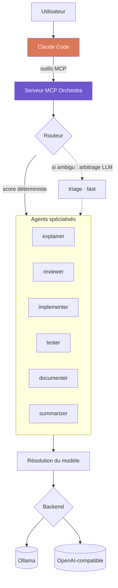

<div align="center">

# Orchestra

**Déléguez les tâches routinières de Claude Code à des agents LLM locaux.**

[](https://www.python.org/)
[](https://modelcontextprotocol.io/)
[](#backends)
[](#tests)
[](LICENSE)

[English](README.md) · **Français**

</div>

---

Orchestra expose un banc d'agents locaux spécialisés comme outils MCP. Claude
reste l'orchestrateur : il garde la vision d'ensemble, décide quoi déléguer et à
qui, et vérifie ce qui revient. Le travail mécanique descend d'un étage :
expliquer une fonction, relire un diff, écrire des tests évidents, condenser des
logs.

Trois propriétés en découlent, par ordre d'importance pratique :

| | |
|---|---|
| 🔒 **Souveraineté** | Le code ne quitte jamais le réseau. Décisif sous NDA, ou en secteur réglementé. |
| 💰 **Coût** | Les tâches routinières passent à coût marginal une fois le matériel amorti. |
| ⚡ **Latence** | Pas d'aller-retour réseau sur les micro-tâches : triage, résumé. |

> [!NOTE]
> Orchestra ne remplace pas Claude. Les modèles locaux 7-8B décrochent nettement
> sur le raisonnement multi-fichiers et l'implémentation complexe. Le gain vient
> de la répartition, pas de la substitution.

---

## Sommaire

- [Comment ça marche](#comment-ça-marche)
- [Backends](#backends)
- [Prérequis](#prérequis)
- [Installation](#installation)
- [Utilisation depuis Claude Code](#utilisation-depuis-claude-code)
- [Ligne de commande](#ligne-de-commande)
- [Configuration](#configuration)
- [Adapter à une autre infrastructure](#adapter-à-une-autre-infrastructure)
- [Structure du projet](#structure-du-projet)
- [Tests](#tests)
- [Limites](#limites)
- [Licence](#licence)

---

## Comment ça marche



**Un agent est une couche de configuration, pas un modèle.** Aucun modèle n'est
cloné ni reconstruit. Un agent, c'est un prompt de rôle, des paramètres
d'inférence et des métadonnées de routage, appliqués à l'appel sur un modèle de
base partagé. Modifier un agent revient à éditer un seul fichier YAML : l'effet
est immédiat au démarrage suivant, aucun poids n'est dupliqué, et tous les agents
d'une même classe réutilisent un unique modèle chargé.

**Un agent ne nomme jamais un modèle.** Il déclare une classe, `fast`, `code` ou
`reason`, résolue au démarrage. La résolution parcourt trois niveaux, par
priorité décroissante : un `pinned_model` explicite sur l'agent, puis la table de
modèles du backend actif, puis le profil matériel détecté sur la machine. La
détection locale mesure la mémoire exploitable, somme la VRAM en multi-GPU et
retombe sur la RAM en l'absence de GPU. Une passerelle distante publie ses
propres noms de modèles et sa propre capacité : dès qu'un backend déclare une
table de modèles, elle l'emporte et la détection locale cesse d'être pertinente.
Le même dossier `agents/` tourne donc sans modification d'un laptop sans GPU à un
serveur bi-GPU ou une passerelle mutualisée.

**Le routage est déterministe d'abord, LLM ensuite.** Un score sur le type de
tâche déclaré et les mots-clés tranche la majorité des demandes pour zéro token.
Les correspondances partielles sont pondérées par la part du libellé
effectivement couverte, si bien qu'un type composé comme `code-review` atteint
l'agent déclarant `review` plutôt que celui déclarant `code`. Seules les demandes
réellement ambiguës basculent vers un arbitrage par le petit modèle `fast`,
contraint en JSON, et un nom d'agent halluciné est rejeté plutôt que suivi.

**Les agents peuvent se piloter entre eux.** `pipeline` les enchaîne, la sortie
de chacun alimentant le contexte du suivant. `refine` exécute une boucle
producteur/critique où un agent produit, un autre critique, et le premier
corrige, jusqu'à ce que le critique réponde `VALIDATED` ou que les tours soient
épuisés. Un livrable peut donc converger localement avant d'atteindre Claude.

---

## Backends

Orchestra parle deux protocoles : l'API native Ollama, et
`/v1/chat/completions` pour tout le reste.

| Backend | Type | Usage typique |
|---|---|---|
| **Ollama** | `ollama` | Inférence locale, par défaut |
| **LiteLLM** | `openai` | Passerelle entreprise : routage central, quotas par équipe, rotation des clés, journalisation |
| **vLLM** | `openai` | Serveur d'inférence dédié haut débit |
| **TGI** | `openai` | Text Generation Inference (Hugging Face) |
| **LM Studio**, **llama.cpp** | `openai` | Alternatives locales à Ollama |
| **OpenRouter**, **Groq**, **Together** | `openai` | Fournisseurs hébergés, utiles pour absorber un pic |
| **Azure OpenAI** et passerelles internes | `openai` | Tout endpoint OpenAI-compatible |

LiteLLM en mode proxy est le point d'entrée entreprise : une passerelle unique
devant n'importe quel ensemble de fournisseurs, où se placent naturellement la
politique de routage, les budgets et la journalisation d'audit.

```bash
ORCHESTRA_BACKEND=litellm LITELLM_API_KEY=... python -m orchestra.cli status
```

> [!IMPORTANT]
> Aucune clé d'API n'est écrite en configuration. Un backend déclare le *nom* de
> la variable d'environnement qui porte sa clé via `api_key_env`. La valeur est
> relue à chaque appel et n'est jamais journalisée.

Les fournisseurs hébergés sont supportés, mais envoyer du code hors du réseau
annule l'argument souveraineté. À utiliser en connaissance de cause.

---

## Prérequis

| | |
|---|---|
| **Python** | 3.10 ou plus |
| **Backend** | [Ollama](https://ollama.com/download) en local, ou tout endpoint OpenAI-compatible |
| **Mémoire** | 8 Go de VRAM recommandés en local. Fonctionne sans GPU sur le profil `cpu` |
| **Disque** | Environ 6 Go pour les modèles du profil `sm` |

Un backend distant n'impose aucun prérequis matériel local.

---

## Installation

```powershell
cd orchestra
.\setup.ps1
```

Le script provisionne un venv local, démarre Ollama si nécessaire, détecte le
profil matériel et télécharge les modèles correspondants.

<details>
<summary>Installation manuelle (Linux / macOS)</summary>

```bash
python -m venv .venv
source .venv/bin/activate
pip install -r requirements.txt

python -m orchestra.cli status   # backend, profil, modèles requis
python -m orchestra.cli pull     # backend local uniquement
```

</details>

### Enregistrer le serveur MCP

```bash
claude mcp add orchestra --scope user -- /chemin/vers/orchestra/.venv/bin/python -m orchestra.mcp_server
```

Sous Windows, l'interpréteur est `.venv\Scripts\python.exe`. Sinon, copiez
[`.mcp.json.example`](.mcp.json.example) en `.mcp.json` et complétez le chemin.

---

## Utilisation depuis Claude Code

Cinq outils sont exposés :

| Outil | Rôle |
|---|---|
| `orchestra_status` | Inventaire des agents, backend actif, santé |
| `ask_agent` | Appelle un agent nommé |
| `delegate` | Laisse le routeur choisir l'agent |
| `pipeline` | Enchaîne les agents, sortie vers contexte du suivant |
| `refine` | Boucle producteur/critique jusqu'à validation |

En pratique, la délégation se demande en langage naturel :

> « Fais condenser ces 4000 lignes de logs par l'agent local avant de les lire. »
>
> « Passe ce diff au reviewer local, en premier filtre avant ta relecture. »
>
> « Fais écrire les tests par les agents locaux, avec une boucle de review. »

### Chaînage

`pipeline` prend une séquence explicite :

```json
[
  { "agent": "implementer", "instruction": "Écris la fonction décrite dans la spec" },
  { "agent": "reviewer",    "instruction": "Relis le code produit" },
  { "agent": "tester",      "instruction": "Écris les tests du code validé" }
]
```

---

## Ligne de commande

Orchestra s'utilise aussi sans Claude Code :

```bash
python -m orchestra.cli status                                    # diagnostic complet
python -m orchestra.cli agents                                    # liste compacte
python -m orchestra.cli backends                                  # backends configurés
python -m orchestra.cli ask reviewer "Relis ce module" --file app.py
python -m orchestra.cli delegate "explique cette erreur" --task explain --file trace.log
python -m orchestra.cli pipeline examples/steps.review.json --input-file app.py
python -m orchestra.cli refine "Écris un parseur d'ISO-8601 sans dépendance"
python -m orchestra.cli pull                                      # backend local uniquement
```

---

## Configuration

### Agents

Un agent par fichier dans [`agents/`](agents/) :

```yaml
name: reviewer
description: Relit un diff et remonte bugs et risques, triés par gravité.
model_class: code            # fast | code | reason
tasks: [review, revue, audit]
keywords: [review, relis, bug, qualite]

temperature: 0.1
num_predict: 1800

system: |
  You are a code reviewer. You report problems; you do not rewrite the file.
  ...
```

| Champ | Rôle |
|---|---|
| `model_class` | **`fast`** triage et résumé · **`code`** implémentation, review, tests · **`reason`** explication, documentation |
| `tasks` | Types de tâches revendiqués, moteur principal du routage |
| `keywords` | Mots déclencheurs quand aucun type n'est fourni |
| `temperature` | 0.0-0.15 pour du code, 0.25-0.35 pour de la prose |
| `num_ctx` | Optionnel, plafonné par le backend ou le profil |
| `pinned_model` | Optionnel, épingle un modèle et court-circuite la résolution |
| `output_format` | `json` pour contraindre la sortie |

Ajouter un agent revient à déposer un YAML dans `agents/`. Rien d'autre à
modifier.

### Profils matériels

[`config/profiles.yaml`](config/profiles.yaml) fait la traduction classe vers
modèle selon la mémoire disponible, pour les backends locaux :

| Profil | Budget mémoire | `fast` | `code` | `reason` | Contexte |
|---|---|---|---|---|---|
| `cpu` | pas de GPU | qwen2.5-coder:1.5b | qwen2.5-coder:3b | llama3.2:3b | 4 096 |
| `xs` | 4-6 Go | qwen2.5-coder:1.5b | qwen2.5-coder:7b | hermes3:3b | 4 096 |
| `sm` | 8-11 Go | qwen2.5-coder:1.5b | qwen2.5-coder:7b | hermes3:8b | 8 192 |
| `md` | 12-20 Go | qwen2.5-coder:3b | qwen2.5-coder:14b | hermes3:8b | 16 384 |
| `lg` | 24-40 Go | qwen2.5-coder:3b | qwen2.5-coder:32b | qwen2.5:32b | 32 768 |
| `xl` | 48 Go et + | qwen2.5-coder:7b | qwen2.5-coder:32b | hermes3:70b | 65 536 |

Le budget est la VRAM totale moins 10 % de marge, ou 60 % de la RAM en mode CPU.
Les VRAM sont sommées en multi-GPU. Apple Silicon utilise la mémoire unifiée × 0,7.

### Backends

[`config/backends.yaml`](config/backends.yaml) déclare les endpoints
disponibles. Un backend peut porter une table `models`, qui prend le pas sur le
profil matériel.

### Variables d'environnement

Toutes optionnelles. Copiez [`.env.example`](.env.example) en `.env`. Le fichier
est chargé au démarrage et n'écrase jamais une variable déjà définie dans
l'environnement réel.

| Variable | Défaut | Rôle |
|---|---|---|
| `ORCHESTRA_BACKEND` | `default` de `backends.yaml` | Backend actif |
| `ORCHESTRA_BASE_URL` | définition du backend | Repointer un backend sans éditer le YAML |
| `ORCHESTRA_PROFILE` | détection automatique | Force un profil matériel |
| `OLLAMA_HOST` | `http://127.0.0.1:11434` | Serveur Ollama |

---

## Adapter à une autre infrastructure

Rien ne change dans `agents/`. Trois leviers couvrent le spectre :

**Serveur d'inférence partagé.** Pointez les postes vers un GPU mutualisé. Un
seul modèle chargé, amorti sur toute l'équipe.

```bash
export ORCHESTRA_BACKEND=vllm
export ORCHESTRA_BASE_URL=http://gpu-server.interne:8000/v1
```

**Passerelle d'entreprise.** Placez LiteLLM devant, et la politique de routage,
les quotas et la journalisation d'audit deviennent un point de configuration
unique plutôt qu'une affaire de poste de travail.

**Autres modèles.** Éditez `config/profiles.yaml` ou la table `models` d'un
backend : DeepSeek-Coder, Codestral, Devstral, Llama, ou vos propres fine-tunes.

---

## Structure du projet

```
orchestra/
├── agents/                    # un agent = un YAML, c'est ici qu'on édite
│   ├── triage.yaml
│   ├── explainer.yaml
│   ├── reviewer.yaml
│   ├── implementer.yaml
│   ├── tester.yaml
│   ├── documenter.yaml
│   └── summarizer.yaml
├── config/
│   ├── profiles.yaml          # classe de modèle -> modèle, par palier mémoire
│   └── backends.yaml          # endpoints d'inférence
├── orchestra/
│   ├── backends/
│   │   ├── base.py            # contrat commun
│   │   ├── ollama.py          # API native Ollama
│   │   └── openai_compat.py   # /v1/chat/completions
│   ├── env.py                 # chargement .env, sans dépendance
│   ├── hardware.py            # détection GPU / RAM (CUDA, ROCm, Metal, CPU)
│   ├── profiles.py            # sélection du profil, résolution des classes
│   ├── config.py              # chargement et validation des agents
│   ├── router.py              # scoring déterministe + triage LLM
│   ├── registry.py            # cœur : agents + profil + backend
│   ├── pipeline.py            # chaînage et boucle producteur/critique
│   ├── mcp_server.py          # serveur MCP (stdio)
│   └── cli.py                 # interface en ligne de commande
├── tests/
├── examples/
└── setup.ps1
```

---

## Tests

```bash
python -m pytest -q
```

La suite couvre la sélection de profil, la validation des agents, les deux
étages de routage, la sélection de backend, la couche de traduction
OpenAI-compatible et le chaînage. Aucun test ne fait d'appel réseau : les
backends passent par un transport simulé et les pipelines par un orchestrateur
factice, ce qui garde la suite rapide et déterministe.

---

## Limites

- **Qualité.** Un 7B ne raisonne pas sur plusieurs fichiers. Réservez-lui les
  tâches locales et bien cadrées, laissez l'architecture à Claude.
- **Swap de modèles.** Sur un GPU 8 Go, alterner `code` et `reason` force Ollama
  à décharger et recharger, soit 5 à 15 s. Les pipelines qui enchaînent des
  agents de la même classe sont nettement plus rapides.
- **Vérification.** La sortie d'un agent local n'est pas une source de vérité.
  Elle doit passer sous les yeux de Claude ou les vôtres.
- **Fine-tuning.** La spécialisation est prompt-level. Un vrai fine-tune (LoRA)
  irait plus loin, au prix d'un dataset et de temps GPU.

---

## Licence

[MIT](LICENSE)
