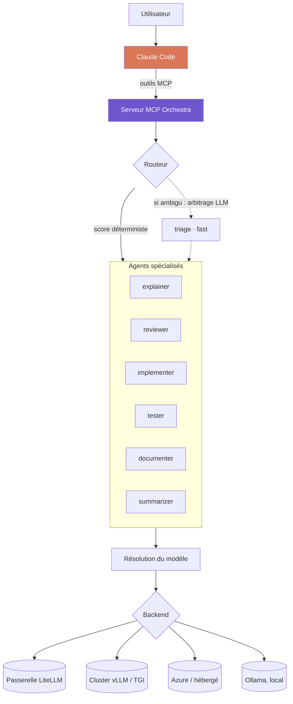

<div align="center">

# Orchestra

**Déléguez les tâches routinières de Claude Code à votre propre infrastructure d'inférence.**

[](https://www.python.org/)
[](https://modelcontextprotocol.io/)
[](#infrastructure)
[](#tests)
[](LICENSE)

[English](README.md) · **Français**

</div>

---

Orchestra expose un banc d'agents spécialisés comme outils MCP, exécutés sur
**l'infrastructure d'inférence dont vous disposez déjà**. Claude reste
l'orchestrateur : il garde la vision d'ensemble, décide quoi déléguer et à qui,
et vérifie ce qui revient. Le travail mécanique descend d'un étage : expliquer
une fonction, relire un diff, écrire des tests évidents, condenser des logs.

Tout endpoint OpenAI-compatible convient, ce qui en pratique les couvre tous :
une passerelle LiteLLM, un cluster vLLM ou TGI, Azure OpenAI, un proxy interne,
un fournisseur hébergé. Ollama est supporté nativement comme option sans
configuration pour un poste isolé par exemple.

Trois propriétés en découlent, par ordre d'importance pratique :

| | |
|---|---|
| 🔒 **Souveraineté** | Avec une inférence auto-hébergée, le code ne quitte jamais votre réseau. Décisif sous NDA, ou en secteur réglementé. |
| 💰 **Coût** | Les tâches routinières quittent la facturation au token pour une capacité déjà payée. |
| ⚡ **Latence** | Pas d'aller-retour externe sur les micro-tâches : triage, résumé. |

> [!NOTE]
> Orchestra ne remplace pas Claude. Les petits modèles décrochent nettement sur
> le raisonnement multi-fichiers et l'implémentation complexe. Le gain vient de
> la répartition, pas de la substitution.

---

## Sommaire

- [Comment ça marche](#comment-ça-marche)
- [Infrastructure](#infrastructure)
- [Installation](#installation)
- [Utilisation depuis Claude Code](#utilisation-depuis-claude-code)
- [Ligne de commande](#ligne-de-commande)
- [Configuration](#configuration)
- [Schémas de déploiement](#schémas-de-déploiement)
- [Structure du projet](#structure-du-projet)
- [Tests](#tests)
- [Limites](#limites)
- [Licence](#licence)

---

## Comment ça marche



**Un agent ne nomme jamais un modèle.** Il déclare une classe, `fast`, `code` ou
`reason`, résolue au démarrage. La résolution parcourt trois niveaux, par
priorité décroissante : un `pinned_model` explicite sur l'agent, puis la table de
modèles du backend actif, puis un profil matériel détecté sur la machine. C'est
cette table de modèles qui rend le système agnostique à l'infrastructure : une
passerelle publie ses propres noms de modèles et sa propre capacité, donc dès
qu'un backend en déclare une, elle l'emporte et la détection matérielle locale
cesse de s'appliquer. La détection ne concerne qu'un backend local, où elle
mesure la mémoire exploitable, somme la VRAM en multi-GPU et retombe sur la RAM
en l'absence de GPU. Le même dossier `agents/` tourne donc sans modification
contre un laptop, un cluster mutualisé ou une passerelle d'entreprise.

**Le routage est déterministe d'abord, LLM ensuite.** Un score sur le type de
tâche déclaré et les mots-clés tranche la majorité des demandes pour zéro token.
Les correspondances partielles sont pondérées par la part du libellé
effectivement couverte, si bien qu'un type composé comme `code-review` atteint
l'agent déclarant `review` plutôt que celui déclarant `code`. Seules les demandes
réellement ambiguës basculent vers un arbitrage par le petit modèle `fast`,
contraint en JSON, et un nom d'agent halluciné est rejeté plutôt que suivi.

**Les agents peuvent se piloter entre eux.** `pipeline` les enchaîne, la sortie
de chacun alimentant le contexte du suivant. `refine` exécute une boucle
producteur/critique où un agent produit, un autre critique, et le premier
corrige, jusqu'à ce que le critique réponde `VALIDATED` ou que les tours soient
épuisés. Un livrable peut donc converger sur votre propre infrastructure avant
d'atteindre Claude.

---

## Infrastructure

Orchestra parle `/v1/chat/completions`, donc tout endpoint OpenAI-compatible est
une cible valide, plus l'API native Ollama pour l'usage local.

| Infrastructure | Type | Usage typique |
|---|---|---|
| **LiteLLM** | `openai` | Passerelle entreprise : routage central, quotas par équipe, rotation des clés, audit |
| **vLLM** | `openai` | Serveur d'inférence dédié haut débit |
| **TGI** | `openai` | Text Generation Inference (Hugging Face) |
| **Azure OpenAI**, proxies internes | `openai` | Tout endpoint d'entreprise derrière votre réseau |
| **OpenRouter**, **Groq**, **Together** | `openai` | Fournisseurs hébergés, utiles pour absorber un pic |
| **LM Studio**, **llama.cpp** | `openai` | Serveurs locaux |
| **Ollama** | `ollama` | Poste isolé, sans configuration |

Les endpoints se déclarent dans [`config/backends.yaml`](config/backends.yaml)
et se sélectionnent au runtime :

```bash
ORCHESTRA_BACKEND=litellm python -m orchestra.cli status
```

### Pointer vers une passerelle existante

La plupart des organisations en exploitent déjà une. Une entrée de backend
demande l'endpoint, le nom de la variable qui porte sa clé, et les noms de
modèles que cet endpoint publie :

```yaml
backends:
  litellm:
    type: openai
    base_url: http://litellm.interne:4000/v1
    api_key_env: LITELLM_API_KEY
    num_ctx: 32768
    models:
      fast: qwen3-1.7b
      code: qwen3-coder-30b
      reason: qwen3-30b
```

La table `models` est le point important : elle court-circuite entièrement la
détection matérielle, car la capacité d'une passerelle n'a aucun rapport avec le
poste qui l'appelle. Sans elle, Orchestra dimensionnerait les modèles sur la
machine locale, ce qui n'a aucun sens pour un endpoint distant.

Pour repointer une entrée existante sans éditer le YAML, par exemple pour
basculer une équipe de la préproduction vers la production :

```bash
ORCHESTRA_BACKEND=vllm ORCHESTRA_BASE_URL=http://gpu-prod.interne:8000/v1 python -m orchestra.cli status
```

> [!IMPORTANT]
> Aucune clé d'API n'est écrite en configuration. Un backend déclare le *nom* de
> la variable d'environnement qui porte sa clé via `api_key_env`. La valeur est
> relue à chaque appel et n'est jamais journalisée. Un test vérifie qu'aucune clé
> en clair ne figure dans le YAML.

> [!WARNING]
> Les fournisseurs hébergés sont supportés, mais envoyer du code hors du réseau
> annule l'argument souveraineté. À utiliser en connaissance de cause.

---

## Installation

```bash
python -m venv .venv
source .venv/bin/activate          # .venv\Scripts\activate sous Windows
pip install -r requirements.txt
```

Puis déclarez votre endpoint et vérifiez le câblage :

```bash
ORCHESTRA_BACKEND=litellm LITELLM_API_KEY=... python -m orchestra.cli status
```

`status` indique le backend actif, le modèle résolu pour chaque agent, et si
l'endpoint répond. Rien d'autre n'est requis : ni GPU, ni runtime local.

<details>
<summary>Installation locale avec Ollama</summary>

Pour une machine sans passerelle vers laquelle pointer, `setup.ps1` provisionne
le venv, démarre Ollama, détecte le profil matériel et télécharge les modèles
correspondants :

```powershell
.\setup.ps1
```

Sous Linux ou macOS, après avoir installé [Ollama](https://ollama.com/download) :

```bash
python -m orchestra.cli status   # profil détecté et modèles requis
python -m orchestra.cli pull     # les télécharge
```

Comptez 3 à 20 Go de téléchargement selon le profil détecté.

</details>

### Enregistrer le serveur MCP

```bash
claude mcp add orchestra --scope user -- /chemin/vers/orchestra/.venv/bin/python -m orchestra.mcp_server
```

Sous Windows, l'interpréteur est `.venv\Scripts\python.exe`. Sinon, copiez
[`.mcp.json.example`](.mcp.json.example) en `.mcp.json` et complétez le chemin.

---

## Utilisation depuis Claude Code

Cinq outils sont exposés :

| Outil | Rôle |
|---|---|
| `orchestra_status` | Inventaire des agents, backend actif, santé |
| `ask_agent` | Appelle un agent nommé |
| `delegate` | Laisse le routeur choisir l'agent |
| `pipeline` | Enchaîne les agents, sortie vers contexte du suivant |
| `refine` | Boucle producteur/critique jusqu'à validation |

En pratique, la délégation se demande en langage naturel :

> « Fais condenser ces 4000 lignes de logs par l'agent local avant de les lire. »
>
> « Passe ce diff à l'agent reviewer, en premier filtre avant ta relecture. »
>
> « Fais écrire les tests par les agents, avec une boucle de review. »

### Chaînage

`pipeline` prend une séquence explicite :

```json
[
  { "agent": "implementer", "instruction": "Écris la fonction décrite dans la spec" },
  { "agent": "reviewer",    "instruction": "Relis le code produit" },
  { "agent": "tester",      "instruction": "Écris les tests du code validé" }
]
```

---

## Ligne de commande

Orchestra s'utilise aussi sans Claude Code :

```bash
python -m orchestra.cli status                                    # backend, modèles, santé
python -m orchestra.cli backends                                  # endpoints configurés
python -m orchestra.cli agents                                    # liste compacte
python -m orchestra.cli ask reviewer "Relis ce module" --file app.py
python -m orchestra.cli delegate "explique cette erreur" --task explain --file trace.log
python -m orchestra.cli pipeline examples/steps.review.json --input-file app.py
python -m orchestra.cli refine "Écris un parseur d'ISO-8601 sans dépendance"
python -m orchestra.cli pull                                      # backend local uniquement
```

---

## Configuration

### Agents

Un agent par fichier dans [`agents/`](agents/) :

```yaml
name: reviewer
description: Relit un diff et remonte bugs et risques, triés par gravité.
model_class: code            # fast | code | reason
tasks: [review, revue, audit]
keywords: [review, relis, bug, qualite]

temperature: 0.1
num_predict: 1800

system: |
  You are a code reviewer. You report problems; you do not rewrite the file.
  ...
```

| Champ | Rôle |
|---|---|
| `model_class` | **`fast`** triage et résumé · **`code`** implémentation, review, tests · **`reason`** explication, documentation |
| `tasks` | Types de tâches revendiqués, moteur principal du routage |
| `keywords` | Mots déclencheurs quand aucun type n'est fourni |
| `temperature` | 0.0-0.15 pour du code, 0.25-0.35 pour de la prose |
| `num_ctx` | Optionnel, plafonné par le backend ou le profil |
| `pinned_model` | Optionnel, épingle un modèle et court-circuite la résolution |
| `output_format` | `json` pour contraindre la sortie |

Ajouter un agent revient à déposer un YAML dans `agents/`. Rien d'autre à
modifier, sur n'importe quel backend.

### Variables d'environnement

Toutes optionnelles. Copiez [`.env.example`](.env.example) en `.env`. Le fichier
est chargé au démarrage et n'écrase jamais une variable déjà définie dans
l'environnement réel.

| Variable | Défaut | Rôle |
|---|---|---|
| `ORCHESTRA_BACKEND` | `default` de `backends.yaml` | Endpoint actif |
| `ORCHESTRA_BASE_URL` | définition du backend | Repointer un endpoint sans éditer le YAML |
| `ORCHESTRA_PROFILE` | détection automatique | Force un profil matériel, backends locaux uniquement |
| `OLLAMA_HOST` | `http://127.0.0.1:11434` | Serveur Ollama |

### Profils matériels

> Utilisés uniquement quand le backend actif ne déclare pas de table `models`,
> ce qui en pratique désigne l'inférence locale. Une passerelle se dimensionne
> elle-même.

[`config/profiles.yaml`](config/profiles.yaml) fait la traduction classe vers
modèle selon la mémoire disponible :

| Profil | Budget mémoire | `fast` | `code` | `reason` | Contexte | Téléchargement |
|---|---|---|---|---|---|---|
| `cpu` | pas de GPU | qwen3:0.6b | qwen2.5-coder:1.5b | qwen3:1.7b | 4 096 | ~2,9 Go |
| `xs` | 4-6 Go | qwen3:0.6b | qwen2.5-coder:3b | qwen3:4b | 8 192 | ~4,9 Go |
| `sm` | 8-11 Go | qwen3:1.7b | qwen2.5-coder:7b | qwen3:8b | 8 192 | ~11 Go |
| `md` | 12-20 Go | qwen3:1.7b | qwen2.5-coder:14b | qwen3:14b | 16 384 | ~20 Go |
| `lg` | 24-40 Go | qwen3:4b | qwen3-coder:30b | qwen3:30b | 32 768 | ~41 Go |
| `xl` | 48-79 Go | qwen3:4b | qwen3-coder:30b | qwen3:30b | 131 072 | ~41 Go |
| `xxl` | 80 Go et + | qwen3:4b | qwen3-coder:30b | gpt-oss:120b | 131 072 | ~87 Go |

Le budget est la VRAM totale moins 10 % de marge, ou 60 % de la RAM en mode CPU.
Les VRAM sont sommées en multi-GPU. Apple Silicon utilise la mémoire unifiée × 0,7.

`xl` fait tourner les mêmes poids que `lg` ; ce que la mémoire supplémentaire
achète, c'est un cache KV bien plus large, d'où le saut de contexte.
`qwen3-coder:30b` et `qwen3:30b` sont tous deux des modèles mixture-of-experts à
environ 3 milliards de paramètres actifs, ce qui explique qu'ils restent
exploitables à 19 Go.

Deux contraintes gouvernent toute modification de ce fichier. `num_ctx`
s'applique aux trois classes, il ne doit donc pas dépasser la plus petite fenêtre
de contexte parmi elles : la famille `qwen2.5-coder` plafonne à 32K et les
`qwen3` denses à 40K, tandis que `qwen3:4b`, `qwen3:30b` et `qwen3-coder:30b`
atteignent 256K. Un test le vérifie. Ensuite, un profil doit loger son plus gros
modèle dans le budget, en laissant de la place pour le cache.

Pour du travail agentique multi-fichiers spécifiquement, `devstral:24b` (14 Go,
contexte 128K) est une alternative solide pour la classe `code` sur une carte de
20 Go ou plus.

### Backends

[`config/backends.yaml`](config/backends.yaml) déclare les endpoints
disponibles. Voir [Infrastructure](#infrastructure) plus haut.

---

## Schémas de déploiement

**Passerelle d'équipe.** Placez LiteLLM devant vos modèles. La politique de
routage, les quotas et la journalisation d'audit deviennent un point de
configuration unique au lieu d'une affaire de poste, et les postes n'ont besoin
que de deux variables d'environnement.

```bash
ORCHESTRA_BACKEND=litellm
LITELLM_API_KEY=...
```

**Cluster d'inférence dédié.** Pointez les postes vers un déploiement vLLM ou
TGI mutualisé. Un seul modèle chargé, amorti sur toute l'équipe, aucun GPU local
requis.

```bash
ORCHESTRA_BACKEND=vllm
ORCHESTRA_BASE_URL=http://gpu-cluster.interne:8000/v1
```

**Poste individuel.** Ollama avec détection matérielle, sans configuration.
Utile pour le travail hors ligne, et pour évaluer le dispositif avant de
provisionner une infrastructure partagée.

**Mixte.** Rien n'empêche différentes équipes de pointer vers différents backends
avec le même dossier `agents/` sous gestion de version, puisque les définitions
d'agents ne portent aucun détail d'infrastructure.

---

## Structure du projet

```
orchestra/
├── agents/                    # un agent = un YAML, c'est ici qu'on édite
│   ├── triage.yaml
│   ├── explainer.yaml
│   ├── reviewer.yaml
│   ├── implementer.yaml
│   ├── tester.yaml
│   ├── documenter.yaml
│   └── summarizer.yaml
├── config/
│   ├── backends.yaml          # endpoints d'inférence
│   └── profiles.yaml          # classe -> modèle, backends locaux uniquement
├── orchestra/
│   ├── backends/
│   │   ├── base.py            # contrat commun
│   │   ├── openai_compat.py   # /v1/chat/completions
│   │   └── ollama.py          # API native Ollama
│   ├── console.py             # sortie UTF-8 robuste
│   ├── env.py                 # chargement .env, sans dépendance
│   ├── hardware.py            # détection GPU / RAM (CUDA, ROCm, Metal, CPU)
│   ├── profiles.py            # sélection du profil, résolution des classes
│   ├── config.py              # chargement et validation des agents
│   ├── router.py              # scoring déterministe + triage LLM
│   ├── registry.py            # cœur : agents + backend + profil
│   ├── pipeline.py            # chaînage et boucle producteur/critique
│   ├── mcp_server.py          # serveur MCP (stdio)
│   └── cli.py                 # interface en ligne de commande
├── tests/
├── examples/
└── setup.ps1                  # amorçage Ollama local
```

---

## Tests

```bash
python -m pytest -q
```

La suite couvre la sélection de backend, la couche de traduction
OpenAI-compatible, la sélection de profil et ses contraintes de contexte, la
validation des agents, les deux étages de routage et le chaînage. Aucun test ne
fait d'appel réseau : les backends passent par un transport simulé et les
pipelines par un orchestrateur factice, ce qui garde la suite rapide et
déterministe.

---

## Limites

- **Qualité.** Les petits modèles ne raisonnent pas sur plusieurs fichiers.
  Réservez-leur les tâches locales et bien cadrées, laissez l'architecture à
  Claude. C'est une affaire de taille de modèle, pas de lieu d'exécution : un
  modèle de 30 B sur un cluster passe la barre qu'un 7 B sur un laptop ne passe
  pas.
- **Swap de modèles.** Sur un GPU local unique, alterner `code` et `reason`
  force un déchargement et un rechargement, soit 5 à 15 s. Une passerelle aux
  modèles résidents n'a pas ce coût, ce qui est une raison de préférer
  l'infrastructure partagée bien avant que l'argument économique n'entre en jeu.
- **Vérification.** La sortie d'un agent n'est pas une source de vérité. Elle
  doit passer sous les yeux de Claude ou les vôtres.
- **Spécialisation.** Elle est prompt-level. Un vrai fine-tune (LoRA) irait plus
  loin, au prix d'un dataset et de temps GPU.

---

## Licence

[MIT](LICENSE)
