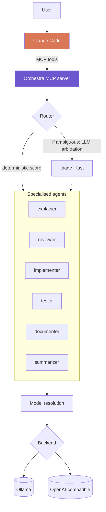

<div align="center">

# Orchestra

**Delegate routine coding tasks from Claude Code to local LLM agents.**

[](https://www.python.org/)
[](https://modelcontextprotocol.io/)
[](#backends)
[](#tests)
[](LICENSE)

**English** · [Français](README.fr.md)

</div>

---

Orchestra exposes a bench of specialised local agents as MCP tools. Claude stays
the orchestrator: it keeps the overall picture, decides what to delegate and to
whom, and checks what comes back. The mechanical work goes down one level:
explaining a function, reviewing a diff, writing obvious tests, condensing logs.

Three properties follow, in order of practical weight:

| | |
|---|---|
| 🔒 **Data residency** | Code never leaves the network. Decisive under NDA, or in regulated sectors. |
| 💰 **Cost** | Routine tasks drop to marginal cost once the hardware is amortised. |
| ⚡ **Latency** | No network round trip on micro-tasks such as triage and summarisation. |

> [!NOTE]
> Orchestra does not replace Claude. Local 7-8B models degrade sharply on
> multi-file reasoning and complex implementation. The gain comes from
> distribution, not substitution.

---

## Contents

- [How it works](#how-it-works)
- [Backends](#backends)
- [Requirements](#requirements)
- [Installation](#installation)
- [Use from Claude Code](#use-from-claude-code)
- [Command line](#command-line)
- [Configuration](#configuration)
- [Adapting to other infrastructure](#adapting-to-other-infrastructure)
- [Project structure](#project-structure)
- [Tests](#tests)
- [Limitations](#limitations)
- [License](#license)

---

## How it works



**An agent is a configuration layer, not a model.** No model is ever cloned or
rebuilt. An agent is a role prompt, inference parameters and routing metadata,
applied at call time on top of a shared base model. Editing an agent means
editing one YAML file: the change takes effect on the next start, no weights are
duplicated, and every agent of the same class reuses a single loaded model.

**An agent never names a model.** It declares a class, `fast`, `code` or
`reason`, and the class is resolved at startup. Resolution walks three levels, in
decreasing priority: an explicit `pinned_model` on the agent, then the active
backend's model map, then the hardware profile detected on the machine. Local
detection measures usable memory, sums multi-GPU VRAM and falls back to RAM when
no GPU is present. A remote gateway publishes its own model names and its own
capacity, so when a backend declares a model map that map wins and local
detection stops being relevant. The same `agents/` directory therefore runs
unchanged from a CPU-only laptop to a dual-GPU server or a shared gateway.

**Routing is deterministic first, LLM second.** A score over the declared task
type and keyword hits settles the majority of requests for zero tokens. Partial
matches are weighted by how much of the task label they actually cover, so a
composite type such as `code-review` reaches the agent declaring `review` rather
than the one declaring `code`. Only genuinely ambiguous requests fall through to
arbitration by the small `fast` model, constrained to JSON, and a hallucinated
agent name is rejected rather than followed.

**Agents can drive each other.** `pipeline` chains them, feeding each output
into the next agent's context. `refine` runs a producer/critic loop where one
agent produces, another critiques, and the first corrects, until the critic
answers `VALIDATED` or the rounds run out. A deliverable can therefore converge
locally before it ever reaches Claude.

---

## Backends

Orchestra speaks two protocols: the native Ollama API, and
`/v1/chat/completions` for everything else.

| Backend | Type | Typical use |
|---|---|---|
| **Ollama** | `ollama` | Local inference, default |
| **LiteLLM** | `openai` | Enterprise gateway: central routing, per-team quotas, key rotation, logging |
| **vLLM** | `openai` | Dedicated high-throughput inference server |
| **TGI** | `openai` | Hugging Face Text Generation Inference |
| **LM Studio**, **llama.cpp** | `openai` | Local alternatives to Ollama |
| **OpenRouter**, **Groq**, **Together** | `openai` | Hosted providers, useful to absorb a spike |
| **Azure OpenAI** and internal gateways | `openai` | Any OpenAI-compatible endpoint |

LiteLLM in proxy mode is the enterprise entry point: a single gateway in front
of any set of providers, which is where routing policy, budgets and audit
logging belong.

```bash
ORCHESTRA_BACKEND=litellm LITELLM_API_KEY=... python -m orchestra.cli status
```

> [!IMPORTANT]
> API keys are never written to configuration. A backend declares the *name* of
> the environment variable holding its key via `api_key_env`. The value is read
> at call time and never logged.

Hosted providers are supported, but sending code off-network cancels the data
residency argument. Use them deliberately.

---

## Requirements

| | |
|---|---|
| **Python** | 3.10 or later |
| **Backend** | [Ollama](https://ollama.com/download) for local use, or any OpenAI-compatible endpoint |
| **Memory** | 8 GB VRAM recommended for local inference. Works without a GPU on the `cpu` profile |
| **Disk** | About 6 GB for the `sm` profile models |

Remote backends have no local hardware requirement.

---

## Installation

```powershell
cd orchestra
.\setup.ps1
```

The script provisions a local virtualenv, starts Ollama if needed, detects the
hardware profile and pulls the matching models.

<details>
<summary>Manual installation (Linux / macOS)</summary>

```bash
python -m venv .venv
source .venv/bin/activate
pip install -r requirements.txt

python -m orchestra.cli status   # backend, profile, required models
python -m orchestra.cli pull     # local backend only
```

</details>

### Register the MCP server

```bash
claude mcp add orchestra --scope user -- /path/to/orchestra/.venv/bin/python -m orchestra.mcp_server
```

On Windows the interpreter is `.venv\Scripts\python.exe`. Alternatively, copy
[`.mcp.json.example`](.mcp.json.example) to `.mcp.json` and fill in the path.

---

## Use from Claude Code

Five tools are exposed:

| Tool | Purpose |
|---|---|
| `orchestra_status` | Agent inventory, active backend, health |
| `ask_agent` | Call a named agent |
| `delegate` | Let the router pick the agent |
| `pipeline` | Chain agents, each output feeding the next |
| `refine` | Producer/critic loop until validation |

In practice delegation is requested in plain language:

> "Have the local agent condense these 4000 lines of logs before you read them."
>
> "Run this diff through the local reviewer as a first pass before yours."
>
> "Have the local agents write the tests, with a review loop."

### Chaining

`pipeline` takes an explicit sequence:

```json
[
  { "agent": "implementer", "instruction": "Write the function described in the spec" },
  { "agent": "reviewer",    "instruction": "Review the code produced" },
  { "agent": "tester",      "instruction": "Write tests for the validated code" }
]
```

---

## Command line

Orchestra also runs standalone:

```bash
python -m orchestra.cli status                                    # full diagnostic
python -m orchestra.cli agents                                    # compact agent list
python -m orchestra.cli backends                                  # configured backends
python -m orchestra.cli ask reviewer "Review this module" --file app.py
python -m orchestra.cli delegate "explain this error" --task explain --file trace.log
python -m orchestra.cli pipeline examples/steps.review.json --input-file app.py
python -m orchestra.cli refine "Write an ISO-8601 parser with no dependency"
python -m orchestra.cli pull                                      # local backend only
```

---

## Configuration

### Agents

One agent per file in [`agents/`](agents/):

```yaml
name: reviewer
description: Reviews a diff and reports bugs and risks, ordered by severity.
model_class: code            # fast | code | reason
tasks: [review, revue, audit]
keywords: [review, relis, bug, qualite]

temperature: 0.1
num_predict: 1800

system: |
  You are a code reviewer. You report problems; you do not rewrite the file.
  ...
```

| Field | Purpose |
|---|---|
| `model_class` | **`fast`** triage and summarisation · **`code`** implementation, review, tests · **`reason`** explanation, documentation |
| `tasks` | Claimed task types, the primary routing signal |
| `keywords` | Trigger words when no task type is supplied |
| `temperature` | 0.0-0.15 for code, 0.25-0.35 for prose |
| `num_ctx` | Optional, capped by the backend or the profile |
| `pinned_model` | Optional, pins a specific model and bypasses resolution |
| `output_format` | `json` to constrain the output |

Adding an agent means dropping a YAML file into `agents/`. Nothing else changes.

### Hardware profiles

[`config/profiles.yaml`](config/profiles.yaml) maps class to model by available
memory, for local backends:

| Profile | Memory budget | `fast` | `code` | `reason` | Context |
|---|---|---|---|---|---|
| `cpu` | no GPU | qwen2.5-coder:1.5b | qwen2.5-coder:3b | llama3.2:3b | 4 096 |
| `xs` | 4-6 GB | qwen2.5-coder:1.5b | qwen2.5-coder:7b | hermes3:3b | 4 096 |
| `sm` | 8-11 GB | qwen2.5-coder:1.5b | qwen2.5-coder:7b | hermes3:8b | 8 192 |
| `md` | 12-20 GB | qwen2.5-coder:3b | qwen2.5-coder:14b | hermes3:8b | 16 384 |
| `lg` | 24-40 GB | qwen2.5-coder:3b | qwen2.5-coder:32b | qwen2.5:32b | 32 768 |
| `xl` | 48 GB and up | qwen2.5-coder:7b | qwen2.5-coder:32b | hermes3:70b | 65 536 |

The budget is total VRAM minus a 10 % margin, or 60 % of RAM in CPU mode.
Multi-GPU VRAM is summed. Apple Silicon uses unified memory × 0.7.

### Backends

[`config/backends.yaml`](config/backends.yaml) declares the available endpoints.
A backend may carry a `models` map, which overrides the hardware profile.

### Environment variables

All optional. Copy [`.env.example`](.env.example) to `.env`. The file is loaded
at startup and never overrides a variable already set in the real environment.

| Variable | Default | Purpose |
|---|---|---|
| `ORCHESTRA_BACKEND` | `default` from `backends.yaml` | Active backend |
| `ORCHESTRA_BASE_URL` | backend definition | Repoint a backend without editing YAML |
| `ORCHESTRA_PROFILE` | auto-detected | Force a hardware profile |
| `OLLAMA_HOST` | `http://127.0.0.1:11434` | Ollama server |

---

## Adapting to other infrastructure

Nothing in `agents/` changes. Three levers cover the range:

**Shared inference server.** Point workstations at a pooled GPU. One model
loaded, amortised across the team.

```bash
export ORCHESTRA_BACKEND=vllm
export ORCHESTRA_BASE_URL=http://gpu-server.internal:8000/v1
```

**Enterprise gateway.** Put LiteLLM in front, and routing policy, quotas and
audit logging become a single point of configuration rather than a per-seat
concern.

**Other models.** Edit `config/profiles.yaml` or a backend's `models` map:
DeepSeek-Coder, Codestral, Devstral, Llama, or your own fine-tunes.

---

## Project structure

```
orchestra/
├── agents/                    # one agent = one YAML, this is what you edit
│   ├── triage.yaml
│   ├── explainer.yaml
│   ├── reviewer.yaml
│   ├── implementer.yaml
│   ├── tester.yaml
│   ├── documenter.yaml
│   └── summarizer.yaml
├── config/
│   ├── profiles.yaml          # model class -> model, by memory tier
│   └── backends.yaml          # inference endpoints
├── orchestra/
│   ├── backends/
│   │   ├── base.py            # backend contract
│   │   ├── ollama.py          # native Ollama API
│   │   └── openai_compat.py   # /v1/chat/completions
│   ├── env.py                 # .env loading, no dependency
│   ├── hardware.py            # GPU / RAM detection (CUDA, ROCm, Metal, CPU)
│   ├── profiles.py            # profile selection and class resolution
│   ├── config.py              # agent loading and validation
│   ├── router.py              # deterministic scoring + LLM triage
│   ├── registry.py            # core: agents + profile + backend
│   ├── pipeline.py            # chaining and producer/critic loop
│   ├── mcp_server.py          # MCP server (stdio)
│   └── cli.py                 # command line interface
├── tests/
├── examples/
└── setup.ps1
```

---

## Tests

```bash
python -m pytest -q
```

The suite covers profile selection, agent validation, both routing stages,
backend selection, the OpenAI-compatible translation layer and chaining. No test
performs a network call: backends are exercised through a mock transport and
pipelines against a stub orchestrator, so the suite stays fast and
deterministic.

---

## Limitations

- **Quality.** A 7B model does not reason across files. Give it local,
  well-bounded tasks and leave architecture to Claude.
- **Model swapping.** On an 8 GB GPU, alternating between `code` and `reason`
  forces Ollama to unload and reload, costing 5 to 15 seconds. Pipelines that
  chain agents of the same class are noticeably faster.
- **Verification.** Local agent output is not a source of truth. It should pass
  under Claude's review or yours.
- **Fine-tuning.** Specialisation is prompt-level. A real fine-tune (LoRA) would
  go further, at the cost of a dataset and GPU time.

---

## License

[MIT](LICENSE)
