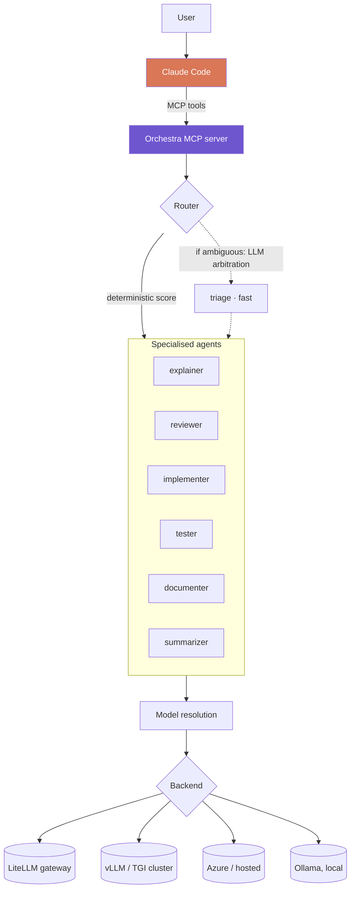

<div align="center">

# Orchestra

**Delegate routine coding tasks from Claude Code to your own inference infrastructure.**

[](https://www.python.org/)
[](https://modelcontextprotocol.io/)
[](#infrastructure)
[](#tests)
[](LICENSE)

**English** · [Français](README.fr.md)

</div>

---

Orchestra exposes a bench of specialised agents as MCP tools, running on
**whatever inference infrastructure you already have**. Claude stays the
orchestrator: it keeps the overall picture, decides what to delegate and to
whom, and checks what comes back. The mechanical work goes down one level:
explaining a function, reviewing a diff, writing obvious tests, condensing logs.

Any OpenAI-compatible endpoint works, which in practice means all of them: a
LiteLLM gateway, a vLLM or TGI cluster, Azure OpenAI, an internal proxy, a
hosted provider. Ollama is supported natively as the zero-configuration option
for a single workstation, but it is one backend among others, not the premise.

Three properties follow, in order of practical weight:

| | |
|---|---|
| 🔒 **Data residency** | With self-hosted inference, code never leaves your network. Decisive under NDA, or in regulated sectors. |
| 💰 **Cost** | Routine tasks move off per-token frontier pricing onto capacity you already pay for. |
| ⚡ **Latency** | No external round trip on micro-tasks such as triage and summarisation. |

> [!NOTE]
> Orchestra does not replace Claude. Small models degrade sharply on multi-file
> reasoning and complex implementation. The gain comes from distribution, not
> substitution.

---

## Contents

- [How it works](#how-it-works)
- [Infrastructure](#infrastructure)
- [Installation](#installation)
- [Use from Claude Code](#use-from-claude-code)
- [Command line](#command-line)
- [Configuration](#configuration)
- [Deployment patterns](#deployment-patterns)
- [Project structure](#project-structure)
- [Tests](#tests)
- [Limitations](#limitations)
- [License](#license)

---

## How it works



**An agent is a configuration layer, not a model.** No model is ever cloned or
rebuilt. An agent is a role prompt, inference parameters and routing metadata,
applied at call time on top of a shared base model. Editing an agent means
editing one YAML file: the change takes effect on the next start, no weights are
duplicated, and every agent of the same class reuses a single loaded model.

**An agent never names a model.** It declares a class, `fast`, `code` or
`reason`, and the class is resolved at startup. Resolution walks three levels, in
decreasing priority: an explicit `pinned_model` on the agent, then the active
backend's model map, then a hardware profile detected on the machine. The model
map is what makes the system infrastructure-agnostic: a gateway publishes its own
model names and its own capacity, so when a backend declares one it wins outright
and local hardware detection stops applying. Detection only matters for a local
backend, where it measures usable memory, sums multi-GPU VRAM and falls back to
RAM when no GPU is present. The same `agents/` directory therefore runs unchanged
against a laptop, a shared cluster or a corporate gateway.

**Routing is deterministic first, LLM second.** A score over the declared task
type and keyword hits settles the majority of requests for zero tokens. Partial
matches are weighted by how much of the task label they actually cover, so a
composite type such as `code-review` reaches the agent declaring `review` rather
than the one declaring `code`. Only genuinely ambiguous requests fall through to
arbitration by the small `fast` model, constrained to JSON, and a hallucinated
agent name is rejected rather than followed.

**Agents can drive each other.** `pipeline` chains them, feeding each output
into the next agent's context. `refine` runs a producer/critic loop where one
agent produces, another critiques, and the first corrects, until the critic
answers `VALIDATED` or the rounds run out. A deliverable can therefore converge
on your own infrastructure before it ever reaches Claude.

---

## Infrastructure

Orchestra speaks `/v1/chat/completions`, so any OpenAI-compatible endpoint is a
valid target, plus the native Ollama API for local use.

| Infrastructure | Type | Typical use |
|---|---|---|
| **LiteLLM** | `openai` | Enterprise gateway: central routing, per-team quotas, key rotation, audit logging |
| **vLLM** | `openai` | Dedicated high-throughput inference server |
| **TGI** | `openai` | Hugging Face Text Generation Inference |
| **Azure OpenAI**, internal proxies | `openai` | Any corporate endpoint behind your own network |
| **OpenRouter**, **Groq**, **Together** | `openai` | Hosted providers, useful to absorb a spike |
| **LM Studio**, **llama.cpp** | `openai` | Local servers |
| **Ollama** | `ollama` | Zero-configuration single workstation |

Endpoints are declared in [`config/backends.yaml`](config/backends.yaml) and
selected at runtime:

```bash
ORCHESTRA_BACKEND=litellm python -m orchestra.cli status
```

### Pointing at an existing gateway

Most organisations already run one. A backend entry needs the endpoint, the name
of the variable holding its key, and the model names that endpoint publishes:

```yaml
backends:
  litellm:
    type: openai
    base_url: http://litellm.internal:4000/v1
    api_key_env: LITELLM_API_KEY
    num_ctx: 32768
    models:
      fast: qwen3-1.7b
      code: qwen3-coder-30b
      reason: qwen3-30b
```

The `models` map is the important part: it overrides hardware detection
entirely, because a gateway's capacity has nothing to do with the workstation
calling it. Without it, Orchestra would try to size models against the local
machine, which is meaningless for a remote endpoint.

To repoint an existing entry without editing YAML, for example to move a team
from staging to production inference:

```bash
ORCHESTRA_BACKEND=vllm ORCHESTRA_BASE_URL=http://gpu-prod.internal:8000/v1 python -m orchestra.cli status
```

> [!IMPORTANT]
> API keys are never written to configuration. A backend declares the *name* of
> the environment variable holding its key via `api_key_env`. The value is read
> at call time and never logged. A test enforces that no plaintext key appears
> in the YAML.

> [!WARNING]
> Hosted providers are supported, but sending code off-network cancels the data
> residency argument. Use them deliberately.

---

## Installation

```bash
python -m venv .venv
source .venv/bin/activate          # .venv\Scripts\activate on Windows
pip install -r requirements.txt
```

Then declare your endpoint and check the wiring:

```bash
ORCHESTRA_BACKEND=litellm LITELLM_API_KEY=... python -m orchestra.cli status
```

`status` reports the active backend, the resolved model per agent, and whether
the endpoint answers. Nothing else is required: no GPU, no local runtime.

<details>
<summary>Local workstation setup with Ollama</summary>

For a machine with no gateway to point at, `setup.ps1` provisions the virtualenv,
starts Ollama, detects the hardware profile and pulls the matching models:

```powershell
.\setup.ps1
```

On Linux or macOS, after installing [Ollama](https://ollama.com/download):

```bash
python -m orchestra.cli status   # detected profile and required models
python -m orchestra.cli pull     # downloads them
```

Expect 3 to 20 GB of downloads depending on the detected profile.

</details>

### Register the MCP server

```bash
claude mcp add orchestra --scope user -- /path/to/orchestra/.venv/bin/python -m orchestra.mcp_server
```

On Windows the interpreter is `.venv\Scripts\python.exe`. Alternatively, copy
[`.mcp.json.example`](.mcp.json.example) to `.mcp.json` and fill in the path.

---

## Use from Claude Code

Five tools are exposed:

| Tool | Purpose |
|---|---|
| `orchestra_status` | Agent inventory, active backend, health |
| `ask_agent` | Call a named agent |
| `delegate` | Let the router pick the agent |
| `pipeline` | Chain agents, each output feeding the next |
| `refine` | Producer/critic loop until validation |

In practice delegation is requested in plain language:

> "Have the local agent condense these 4000 lines of logs before you read them."
>
> "Run this diff through the reviewer agent as a first pass before yours."
>
> "Have the agents write the tests, with a review loop."

### Chaining

`pipeline` takes an explicit sequence:

```json
[
  { "agent": "implementer", "instruction": "Write the function described in the spec" },
  { "agent": "reviewer",    "instruction": "Review the code produced" },
  { "agent": "tester",      "instruction": "Write tests for the validated code" }
]
```

---

## Command line

Orchestra also runs standalone:

```bash
python -m orchestra.cli status                                    # backend, models, health
python -m orchestra.cli backends                                  # configured endpoints
python -m orchestra.cli agents                                    # compact agent list
python -m orchestra.cli ask reviewer "Review this module" --file app.py
python -m orchestra.cli delegate "explain this error" --task explain --file trace.log
python -m orchestra.cli pipeline examples/steps.review.json --input-file app.py
python -m orchestra.cli refine "Write an ISO-8601 parser with no dependency"
python -m orchestra.cli pull                                      # local backend only
```

---

## Configuration

### Agents

One agent per file in [`agents/`](agents/):

```yaml
name: reviewer
description: Reviews a diff and reports bugs and risks, ordered by severity.
model_class: code            # fast | code | reason
tasks: [review, revue, audit]
keywords: [review, relis, bug, qualite]

temperature: 0.1
num_predict: 1800

system: |
  You are a code reviewer. You report problems; you do not rewrite the file.
  ...
```

| Field | Purpose |
|---|---|
| `model_class` | **`fast`** triage and summarisation · **`code`** implementation, review, tests · **`reason`** explanation, documentation |
| `tasks` | Claimed task types, the primary routing signal |
| `keywords` | Trigger words when no task type is supplied |
| `temperature` | 0.0-0.15 for code, 0.25-0.35 for prose |
| `num_ctx` | Optional, capped by the backend or the profile |
| `pinned_model` | Optional, pins a specific model and bypasses resolution |
| `output_format` | `json` to constrain the output |

Adding an agent means dropping a YAML file into `agents/`. Nothing else changes,
on any backend.

### Environment variables

All optional. Copy [`.env.example`](.env.example) to `.env`. The file is loaded
at startup and never overrides a variable already set in the real environment.

| Variable | Default | Purpose |
|---|---|---|
| `ORCHESTRA_BACKEND` | `default` from `backends.yaml` | Active endpoint |
| `ORCHESTRA_BASE_URL` | backend definition | Repoint an endpoint without editing YAML |
| `ORCHESTRA_PROFILE` | auto-detected | Force a hardware profile, local backends only |
| `OLLAMA_HOST` | `http://127.0.0.1:11434` | Ollama server |

### Hardware profiles

> Only used when the active backend declares no `models` map, which in practice
> means local inference. A gateway sizes itself.

[`config/profiles.yaml`](config/profiles.yaml) maps class to model by available
memory:

| Profile | Memory budget | `fast` | `code` | `reason` | Context | Download |
|---|---|---|---|---|---|---|
| `cpu` | no GPU | qwen3:0.6b | qwen2.5-coder:1.5b | qwen3:1.7b | 4 096 | ~2.9 GB |
| `xs` | 4-6 GB | qwen3:0.6b | qwen2.5-coder:3b | qwen3:4b | 8 192 | ~4.9 GB |
| `sm` | 8-11 GB | qwen3:1.7b | qwen2.5-coder:7b | qwen3:8b | 8 192 | ~11 GB |
| `md` | 12-20 GB | qwen3:1.7b | qwen2.5-coder:14b | qwen3:14b | 16 384 | ~20 GB |
| `lg` | 24-40 GB | qwen3:4b | qwen3-coder:30b | qwen3:30b | 32 768 | ~41 GB |
| `xl` | 48-79 GB | qwen3:4b | qwen3-coder:30b | qwen3:30b | 131 072 | ~41 GB |
| `xxl` | 80 GB and up | qwen3:4b | qwen3-coder:30b | gpt-oss:120b | 131 072 | ~87 GB |

The budget is total VRAM minus a 10 % margin, or 60 % of RAM in CPU mode.
Multi-GPU VRAM is summed. Apple Silicon uses unified memory × 0.7.

`xl` runs the same weights as `lg`; what the extra memory buys is a far larger
KV cache, hence the context jump. `qwen3-coder:30b` and `qwen3:30b` are both
mixture-of-experts models with roughly 3 B active parameters, which is why they
stay usable at 19 GB.

Two constraints govern any edit to this file. `num_ctx` applies to all three
classes, so it must not exceed the smallest context window among them: the
`qwen2.5-coder` family caps at 32K and dense `qwen3` at 40K, while `qwen3:4b`,
`qwen3:30b` and `qwen3-coder:30b` reach 256K. A test enforces this. Second, a
profile must fit its largest model in the budget, with room left for the cache.

For agentic multi-file work specifically, `devstral:24b` (14 GB, 128K context)
is a strong alternative for the `code` class on a 20 GB or larger card.

### Backends

[`config/backends.yaml`](config/backends.yaml) declares the available endpoints.
See [Infrastructure](#infrastructure) above.

---

## Deployment patterns

**Team gateway.** Put LiteLLM in front of your models. Routing policy, quotas
and audit logging become a single point of configuration instead of a per-seat
concern, and workstations need only two environment variables.

```bash
ORCHESTRA_BACKEND=litellm
LITELLM_API_KEY=...
```

**Dedicated inference cluster.** Point workstations at a pooled vLLM or TGI
deployment. One model loaded, amortised across the team, no local GPU
requirement.

```bash
ORCHESTRA_BACKEND=vllm
ORCHESTRA_BASE_URL=http://gpu-cluster.internal:8000/v1
```

**Individual workstation.** Ollama with hardware detection, no configuration.
Useful for offline work and for evaluating the setup before provisioning
shared infrastructure.

**Mixed.** Nothing prevents different teams from pointing at different backends
with the same `agents/` directory under version control, since the agent
definitions carry no infrastructure detail.

---

## Project structure

```
orchestra/
├── agents/                    # one agent = one YAML, this is what you edit
│   ├── triage.yaml
│   ├── explainer.yaml
│   ├── reviewer.yaml
│   ├── implementer.yaml
│   ├── tester.yaml
│   ├── documenter.yaml
│   └── summarizer.yaml
├── config/
│   ├── backends.yaml          # inference endpoints
│   └── profiles.yaml          # model class -> model, local backends only
├── orchestra/
│   ├── backends/
│   │   ├── base.py            # backend contract
│   │   ├── openai_compat.py   # /v1/chat/completions
│   │   └── ollama.py          # native Ollama API
│   ├── console.py             # UTF-8 safe output
│   ├── env.py                 # .env loading, no dependency
│   ├── hardware.py            # GPU / RAM detection (CUDA, ROCm, Metal, CPU)
│   ├── profiles.py            # profile selection and class resolution
│   ├── config.py              # agent loading and validation
│   ├── router.py              # deterministic scoring + LLM triage
│   ├── registry.py            # core: agents + backend + profile
│   ├── pipeline.py            # chaining and producer/critic loop
│   ├── mcp_server.py          # MCP server (stdio)
│   └── cli.py                 # command line interface
├── tests/
├── examples/
└── setup.ps1                  # local Ollama bootstrap
```

---

## Tests

```bash
python -m pytest -q
```

The suite covers backend selection, the OpenAI-compatible translation layer,
profile selection and its context constraints, agent validation, both routing
stages and chaining. No test performs a network call: backends are exercised
through a mock transport and pipelines against a stub orchestrator, so the suite
stays fast and deterministic.

---

## Limitations

- **Quality.** Small models do not reason across files. Give them local,
  well-bounded tasks and leave architecture to Claude. This is a function of
  model size, not of where it runs: a 30 B model on a cluster clears the bar
  that a 7 B model on a laptop does not.
- **Model swapping.** On a single local GPU, alternating between `code` and
  `reason` forces an unload and reload, costing 5 to 15 seconds. A gateway with
  resident models has no such cost, which is one reason shared infrastructure
  outperforms per-seat hardware well before the cost argument kicks in.
- **Verification.** Agent output is not a source of truth. It should pass under
  Claude's review or yours.
- **Specialisation.** It is prompt-level. A real fine-tune (LoRA) would go
  further, at the cost of a dataset and GPU time.

---

## License

[MIT](LICENSE)
