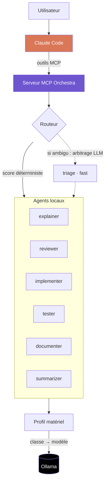

<div align="center">

# Orchestra

**Déléguez les tâches routinières de Claude Code à des agents LLM locaux.**

[](https://www.python.org/)
[](https://modelcontextprotocol.io/)
[](https://ollama.com/)
[](#tests)
[](LICENSE)

</div>

---

## Sommaire

- [Le problème](#le-problème)
- [Comment ça marche](#comment-ça-marche)
- [Prérequis](#prérequis)
- [Installation](#installation)
- [Utilisation depuis Claude Code](#utilisation-depuis-claude-code)
- [Utilisation en CLI](#utilisation-en-cli)
- [Configuration](#configuration)
- [Adapter à une autre machine](#adapter-à-une-autre-machine)
- [Structure du projet](#structure-du-projet)
- [Tests](#tests)
- [Limites connues](#limites-connues)
- [Licence](#licence)

---

## Le problème

Une part importante de ce qu'on demande à un assistant de code est routinière :
résumer des logs, expliquer une fonction, relire un diff, écrire des tests
évidents, rédiger une docstring. Ces tâches ne demandent pas un modèle
frontière — mais elles sont facturées au même tarif que celles qui en ont
besoin.

Orchestra expose un banc d'**agents locaux spécialisés** comme outils MCP.
Claude reste l'orchestrateur : il garde la vision d'ensemble, décide quoi
déléguer, à qui, et vérifie ce qui revient. Le travail mécanique descend d'un
étage.

**Trois bénéfices, par ordre d'importance réelle :**

| | |
|---|---|
| 🔒 **Souveraineté** | Le code ne quitte jamais le réseau. Décisif en finance, santé, défense, ou sur du code sous NDA. |
| 💰 **Coût** | Les tâches routinières passent à coût marginal nul une fois le matériel amorti. |
| ⚡ **Latence** | Pas d'aller-retour réseau sur les micro-tâches (triage, résumé). |

> [!NOTE]
> **Orchestra ne remplace pas Claude.** Les modèles locaux 7-8B décrochent
> nettement sur le raisonnement multi-fichiers et l'implémentation complexe.
> Le gain vient de la répartition, pas de la substitution.

---

## Comment ça marche



### Les trois idées du design

**1. Un agent est une configuration, pas un modèle.**
Aucun modèle n'est cloné ni recréé. Un agent = un system prompt métier + des
paramètres d'inférence + des métadonnées de routage, appliqués à l'appel sur un
modèle de base partagé. Modifier un agent, c'est éditer un YAML — effet
immédiat, aucune reconstruction, aucun poids dupliqué.

**2. Un agent ne nomme jamais un modèle.**
Il déclare une **classe** : `fast`, `code` ou `reason`. Le profil matériel
détecté au démarrage traduit la classe en modèle réel. Le même dossier
`agents/` tourne sur un laptop 8 Go et sur un serveur bi-GPU 48 Go, sans
modification.

**3. Le routage est déterministe d'abord, LLM ensuite.**
Un score sur le type de tâche et les mots-clés tranche la majorité des cas pour
zéro token. Seules les demandes réellement ambiguës déclenchent un arbitrage
par le petit modèle `fast`, en JSON contraint.

---

## Prérequis

| | |
|---|---|
| **Python** | 3.10 ou plus |
| **[Ollama](https://ollama.com/download)** | installé et démarré |
| **Mémoire** | 8 Go de VRAM recommandés. Fonctionne sans GPU (profil `cpu`, plus lent) |
| **Disque** | ~6 Go pour les modèles du profil `sm` |

---

## Installation

```powershell
cd orchestra
.\setup.ps1
```

Le script installe les dépendances dans un venv local, démarre Ollama si
nécessaire, détecte le profil matériel et télécharge les modèles correspondants.

<details>
<summary>Installation manuelle (Linux / macOS)</summary>

```bash
python -m venv .venv
source .venv/bin/activate
pip install -r requirements.txt

python -m orchestra.cli status   # profil détecté + modèles requis
python -m orchestra.cli pull     # télécharge les modèles du profil
```

</details>

### Enregistrer le serveur MCP

```bash
claude mcp add orchestra --scope user -- /chemin/vers/orchestra/.venv/bin/python -m orchestra.mcp_server
```

Sous Windows, l'interpréteur est `.venv\Scripts\python.exe`. Sinon, copiez
[`.mcp.json.example`](.mcp.json.example) en `.mcp.json` et complétez le chemin.

---

## Utilisation depuis Claude Code

Cinq outils sont exposés :

| Outil | Rôle |
|---|---|
| `orchestra_status` | Inventaire des agents, profil matériel, état d'Ollama |
| `ask_agent` | Appelle un agent nommé |
| `delegate` | Laisse le routeur choisir l'agent |
| `pipeline` | Enchaîne plusieurs agents, sortie → contexte du suivant |
| `refine` | Boucle producteur / critique jusqu'à validation |

En pratique, la délégation se demande en langage naturel :

> « Fais résumer ces 4000 lignes de logs par l'agent local avant de les lire. »
>
> « Passe ce diff au reviewer local, je veux un premier filtre avant ta relecture. »
>
> « Fais écrire les tests par les agents locaux, avec une boucle de review. »

### Chaînage

`pipeline` fait travailler un agent à partir de la sortie d'un autre :

```json
[
  { "agent": "implementer", "instruction": "Écris la fonction décrite dans la spec" },
  { "agent": "reviewer",    "instruction": "Relis le code produit" },
  { "agent": "tester",      "instruction": "Écris les tests du code validé" }
]
```

`refine` automatise le cas le plus utile : produire → critiquer → corriger, en
boucle, jusqu'à ce que le critique réponde `VALIDATED` ou que les tours soient
épuisés. Le livrable converge localement avant de remonter à Claude.

---

## Utilisation en CLI

Orchestra s'utilise aussi sans Claude Code :

```bash
python -m orchestra.cli status                                    # diagnostic complet
python -m orchestra.cli agents                                    # liste compacte
python -m orchestra.cli ask reviewer "Relis ce module" --file app.py
python -m orchestra.cli delegate "explique cette erreur" --task explain --file trace.log
python -m orchestra.cli pipeline examples/steps.review.json --input-file app.py
python -m orchestra.cli refine "Écris un parseur d'ISO-8601 sans dépendance"
python -m orchestra.cli pull                                      # modèles du profil
```

---

## Configuration

### Agents

Un agent par fichier dans [`agents/`](agents/) :

```yaml
name: reviewer
description: Relit un diff et remonte bugs et risques, triés par gravité.
model_class: code            # fast | code | reason
tasks: [review, revue, audit]
keywords: [review, relis, bug, qualite]

temperature: 0.1
num_predict: 1800

system: |
  You are a code reviewer. You report problems; you do not rewrite the file.
  ...
```

| Champ | Rôle |
|---|---|
| `model_class` | **`fast`** triage et résumé · **`code`** implémentation, review, tests · **`reason`** explication, documentation |
| `tasks` | Types de tâches revendiqués — moteur principal du routage |
| `keywords` | Mots déclencheurs quand aucun type n'est fourni |
| `temperature` | 0.0–0.15 pour du code, 0.25–0.35 pour de la prose |
| `num_ctx` | Optionnel. Plafonné par le profil : un agent ne peut pas faire déborder la VRAM |
| `pinned_model` | Optionnel. Épingle un modèle précis et court-circuite le profil |
| `output_format` | `json` pour contraindre la sortie |

**Ajouter un agent** : déposez un YAML dans `agents/`, il est chargé au
démarrage suivant. Rien d'autre à modifier.

### Profils matériels

[`config/profiles.yaml`](config/profiles.yaml) fait la traduction
classe → modèle selon la mémoire disponible :

| Profil | Budget mémoire | `fast` | `code` | `reason` | Contexte |
|---|---|---|---|---|---|
| `cpu` | pas de GPU | qwen2.5-coder:1.5b | qwen2.5-coder:3b | llama3.2:3b | 4 096 |
| `xs` | 4–6 Go | qwen2.5-coder:1.5b | qwen2.5-coder:7b | hermes3:3b | 4 096 |
| `sm` | 8–11 Go | qwen2.5-coder:1.5b | qwen2.5-coder:7b | hermes3:8b | 8 192 |
| `md` | 12–20 Go | qwen2.5-coder:3b | qwen2.5-coder:14b | hermes3:8b | 16 384 |
| `lg` | 24–40 Go | qwen2.5-coder:3b | qwen2.5-coder:32b | qwen2.5:32b | 32 768 |
| `xl` | 48 Go et + | qwen2.5-coder:7b | qwen2.5-coder:32b | hermes3:70b | 65 536 |

Le budget est la VRAM totale moins 10 % de marge, ou 60 % de la RAM en mode
CPU. Multi-GPU : les VRAM sont sommées. Apple Silicon : mémoire unifiée × 0,7.

### Variables d'environnement

Toutes optionnelles. Copiez [`.env.example`](.env.example) en `.env` — le
fichier est chargé au démarrage, et **une variable déjà définie dans
l'environnement réel n'est jamais écrasée**.

| Variable | Défaut | Rôle |
|---|---|---|
| `OLLAMA_HOST` | `http://127.0.0.1:11434` | Serveur Ollama. Pointez-le vers un GPU mutualisé pour un déploiement d'équipe |
| `ORCHESTRA_PROFILE` | détection automatique | Force un profil (`cpu`, `xs`, `sm`, `md`, `lg`, `xl`) |

---

## Adapter à une autre machine

Rien à modifier dans `agents/`. Trois leviers suffisent :

**Serveur d'inférence partagé.** Pointez les postes vers un GPU mutualisé —
c'est le déploiement qui a le plus de sens en entreprise : un seul modèle
chargé, amorti sur toute l'équipe.

```bash
export OLLAMA_HOST=http://gpu-server.interne:11434
export ORCHESTRA_PROFILE=xl
```

**Autres modèles.** Éditez `config/profiles.yaml` — DeepSeek-Coder, Codestral,
Devstral, Llama, ou vos propres modèles fine-tunés.

**Agent hors profil.** `pinned_model` épingle un modèle sur un agent précis,
indépendamment du matériel détecté.

---

## Structure du projet

```
orchestra/
├── agents/                    # ← un agent = un YAML (c'est ici qu'on édite)
│   ├── triage.yaml
│   ├── explainer.yaml
│   ├── reviewer.yaml
│   ├── implementer.yaml
│   ├── tester.yaml
│   ├── documenter.yaml
│   └── summarizer.yaml
├── config/
│   └── profiles.yaml          # classe de modèle → modèle réel, par palier mémoire
├── orchestra/
│   ├── env.py                 # chargement .env (sans dépendance)
│   ├── hardware.py            # détection GPU / RAM (CUDA, ROCm, Metal, CPU)
│   ├── profiles.py            # sélection du profil, résolution des classes
│   ├── config.py              # chargement et validation des agents
│   ├── ollama_client.py       # client HTTP Ollama
│   ├── router.py              # scoring déterministe + triage LLM
│   ├── registry.py            # cœur : agents + profil + exécution
│   ├── pipeline.py            # chaînage et boucle producteur/critique
│   ├── mcp_server.py          # serveur MCP (stdio)
│   └── cli.py                 # interface en ligne de commande
├── tests/
├── examples/
└── setup.ps1
```

---

## Tests

```bash
python -m pytest -q
```

La suite couvre la sélection de profil, la validation des agents, les deux
étages de routage et le chaînage — sans jamais appeler Ollama : les tests de
pipeline s'exécutent contre un orchestrateur factice et restent donc rapides et
déterministes.

---

## Limites connues

- **Qualité.** Un 7B ne raisonne pas sur plusieurs fichiers. Réservez-lui les
  tâches locales et bien cadrées ; laissez l'architecture à Claude.
- **Swap de modèles.** Sur un GPU 8 Go, alterner `code` et `reason` force
  Ollama à décharger et recharger — comptez 5 à 15 s. Les pipelines qui
  enchaînent deux agents de la même classe sont nettement plus rapides.
- **Vérification.** La sortie d'un agent local n'est pas une source de vérité.
  Elle doit passer sous les yeux de Claude ou les vôtres.
- **Fine-tuning.** La spécialisation est prompt-level. Un vrai fine-tuning
  (LoRA) donnerait davantage, au prix d'un dataset et de temps GPU.

---

## Licence

[MIT](LICENSE)
